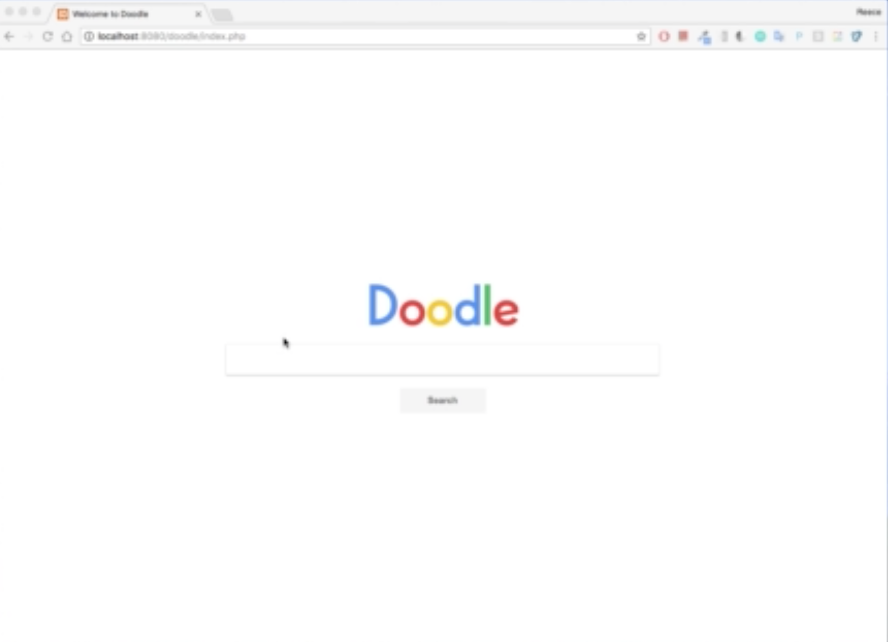

# Search Engine
This is a search engine that analyzes a content of a page, catalogs images and video files embedded on the page.

# Requirements
- Crawl website
- Search for links and images
- Pagination system

# Tech Stack
- Visual Studio Code
- Ajax
- Xamp

# Schema

### User

This page focuses on web pages. Doodle follows three basic steps to generate results from web pages

- Crawling
- Indexing
- Serving

### Project

- name: Doodle 
- description: textfield
- createdAt: timestamp
- updatedAt: timestamp

### Log
- text: textfield
- createdAt: timestamp
- updatedAt: timestamp
